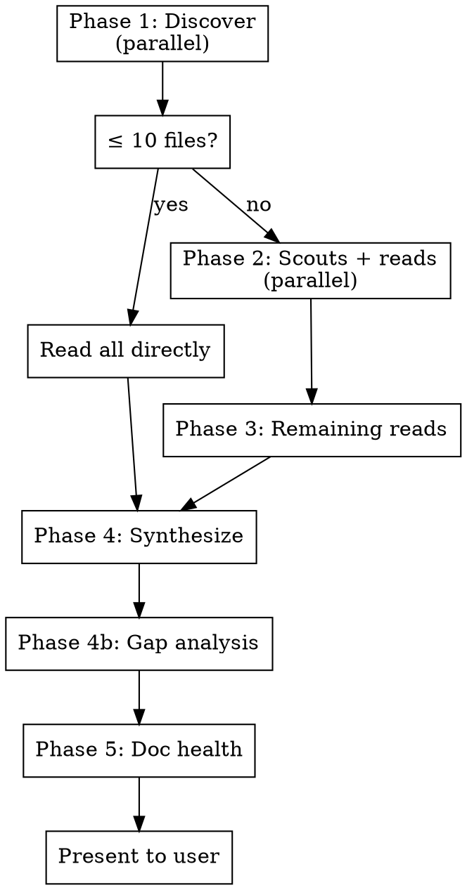

# Recon

Full-spectrum project reconnaissance. Scans documentation, cross-references claims against the codebase, audits doc health, and presents prioritized next steps.

**Always runs the full pipeline.**

## Execution Flow



---

## Phase 1: Discover Docs

**Run all three sources in parallel** (single message, multiple tool calls), then combine and deduplicate.

**Memory:** Read MEMORY.md and memory files in the project's auto-memory directory.

**Convention scan:** Glob for:
- `*.md`, `docs/**/*.md`, `specs/**/*.md`, `plans/**/*.md`
- `.claude/**/*.md`, `**/CLAUDE.md`
- `*.rst`, `*.adoc` (secondary — include if found, don't prioritize over .md)

**Git context:** Run `git log --oneline -15` to understand recent activity. Note which areas of the codebase are actively changing — this informs priority in Phase 4.

**Extended scan (only if above yields < 5 files):**
- `**/*.md` excluding `node_modules`, `.git`, `vendor`, `dist`, `build`
- Cap at 50 files, prioritize by most recently modified

**Categorize every file:**

| Category | Signal words / paths | Covers |
|----------|---------------------|--------|
| **Prompt Engineering** | `CLAUDE.md`, `AGENTS.md`, `GEMINI.md`, `.claude/`, skills, hooks | AI agent instructions, prompt optimization |
| **Context Engineering** | `status`, `handoff`, `context`, `memory`, `dev_notes`, `MEMORY.md` | Project state, session continuity |
| **Intent Engineering** | `overview`, `vision`, `goals`, `why`, `purpose`, `intent` | Why we're building, success criteria |
| **Specification Engineering** | `spec`, `design`, `plan`, `architecture`, `RFC`, `ADR` | What to build, how, standards |
| **Task Engineering** | `todo`, `tasks`, `backlog`, `roadmap`, `issues`, `decisions` | What's next, priorities, blockers |

> **Note:** These category definitions are provisional and under refinement. Use your best judgment when a file doesn't clearly fit.

---

## Phase 2: Scan Docs

**≤ 10 files:** Read all directly in main context. Skip to Phase 4.

**> 10 files:** Dispatch parallel subagents with these rules:

- **Merge small categories** — don't spawn a scout for <3 files. Combine into fewer scouts (aim for 2-4 total).
- **Parallel deep-read kickoff** — in the same message as scout dispatch, also Read the primary todo, primary spec, and any file modified in the last 24 hours. This overlaps scout wait time with useful reads.

Scout instructions (Explore type):
```
Recon scout. For EACH file:
1. Summary (3-5 lines): contents and current state
2. Staleness signals: outdated dates, status labels, claims
3. Overlap: content duplicated in other files
4. Codebase reality check: Glob/Grep to verify paths, files, features
   mentioned in the doc actually exist. Note discrepancies.

IMPORTANT: Only reality-check DESCRIPTIVE docs (README, CLAUDE.md, specs,
status, todos). Skip PRESCRIPTIVE content (instructions, templates, code
blocks, files under skills/) — these describe behavior, not current state.

Files to scan: [LIST]
```

---

## Phase 3: Selective Deep Read

Read **remaining** files in main context (some already read from Phase 2 kickoff).

**Read if (and not already read):**
- Has staleness signals or codebase discrepancies
- Contains task lists or next steps
- Is the primary spec or todo
- Modified in the last 7 days

**Budget: up to 20,000 tokens** for deep reads. If qualifying files exceed this, prioritize: primary spec > primary todo > files with discrepancies > recently modified.

---

## Phase 4: Synthesize & Present

Cross-reference all findings (summaries + deep reads + memory + git log). Produce:

```markdown
## Project Recon — [Date]

### Current State
[2-3 sentences — where the project stands, informed by git activity]

### Next Steps
#### Critical (blockers, broken things)
#### Important (unblocks other work)
#### Normal (independent improvements)
#### Low (backlog)

Each item: [P#] **[Category]** — [Description]

### Key Findings
- [Cross-reference insight]
- [Doc vs codebase discrepancy]
- [Non-obvious relationship]
```

### Gap Analysis

Check which of the 5 categories have **zero files**. For each gap:
1. Name it
2. Explain why it matters *for this specific project* (not generic advice)
3. Propose a concrete file with 1-2 sentence description
4. Ask the user: "Want me to create any of these?"

If agreed, create files with **real content from this recon session** — never placeholders.

---

## Phase 5: Doc Health

Present **all** proposed changes together, grouped by confidence:

```markdown
### Doc Health: Proposed Changes

**Auto-fixes** (typos, provably wrong status, stale dates, exact duplicates):
1. [File] — [change] — Reason: [why]
2. ...

**Suggested edits** (restructuring, merging overlap, rewording, consolidating):
3. [File] — Before: [x] → After: [y] — Reason: [why]
4. ...

Options: `apply all` | `auto-fixes only` | `suggested only` | `skip all`
  or cherry-pick: `apply 1,2,4 skip 3`
```

**IMPORTANT:** Never remove nuanced information, caveats, or domain context. When in doubt, include it as a suggested edit, not an auto-fix.

---

## Common Mistakes

- **Subagents on small repos** — ≤ 10 files → read directly.
- **Reality-checking prescriptive content** — skills, templates, and code blocks describe behavior, not current state. Skip them.
- **Hoarding read budget** — use the full 20K tokens. Better context = better synthesis.
- **Ignoring git history** — recent commits reveal what's active. A `git log` is one of the highest-signal inputs.
- **Ignoring empty categories** — a missing spec or intent doc is a finding, not a non-event.
- **Over-editing** — when unsure, make it a suggested edit, not an auto-fix.
