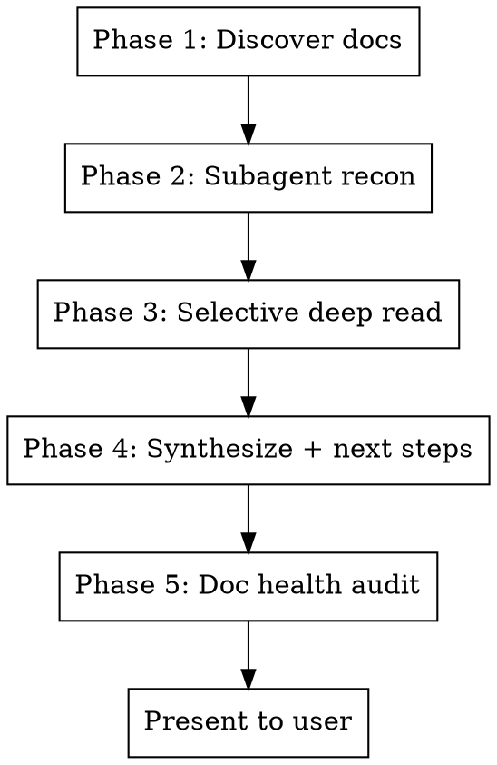

# Recon

Full-spectrum project reconnaissance. Reads all documentation (specs, todos, context, intent, prompt/specification engineering), verifies claims against the actual codebase, audits doc health, and presents prioritized next steps.

**Always runs the full pipeline. No sub-modes.**

## Execution Flow



---

## Phase 1: Discover Docs

Find all documentation files using a layered approach. Move to the next layer if the previous one yields insufficient results.

**Layer 1 — Explicit config:**
Check CLAUDE.md for a `## Recon Files` or `## Spec Files` section. If found, use that list as primary source.

**Layer 2 — Memory:**
Read MEMORY.md and memory files in the project's auto-memory directory.

**Layer 3 — Convention scan:**
Glob for:
- Root: `*.md` (spec.md, todo.md, status.md, dev_notes.md, README.md, etc.)
- `docs/**/*.md`, `specs/**/*.md`, `plans/**/*.md`
- `.claude/**/*.md` (skills, memory)
- `CLAUDE.md` at any depth

**Layer 4 — Extended scan (if Layer 3 yields < 5 files):**
- `**/*.md` excluding `node_modules`, `.git`, `vendor`, `dist`, `build`, `CHANGELOG.md`
- Cap at 50 files; prioritize by most recently modified

**Categorize every file into one or more categories:**

| Category | Signal words / paths | Covers |
|----------|---------------------|--------|
| **Prompt Engineering** | `CLAUDE.md`, `AGENTS.md`, `GEMINI.md`, `.claude/`, skills, hooks | AI agent instructions, prompt optimization |
| **Context Engineering** | `status`, `handoff`, `context`, `memory`, `dev_notes`, `MEMORY.md` | Project state, session continuity |
| **Intent Engineering** | `overview`, `vision`, `goals`, `why`, `purpose`, `intent`, spec preamble | Why we're building, success criteria |
| **Specification Engineering** | `spec`, `design`, `plan`, `architecture`, `RFC`, `ADR`, `docs/plans/` | What to build, how, standards |
| **Task Engineering** | `todo`, `tasks`, `backlog`, `roadmap`, `issues`, `decisions` | What's next, priorities, blockers |

---

## Phase 2: Subagent Recon

Dispatch **parallel subagents** (Explore type, one per category that has files). Each subagent receives the file list for its category and these instructions:

```
You are a recon scout for project documentation.

For EACH file in your list:
1. **Summary** (3-5 lines): What this file contains and its current state
2. **Staleness signals**: Dates, status labels, or claims that appear outdated
3. **Overlap**: Content duplicated in other files you've read
4. **Codebase reality check**: Use Glob and Grep to verify that files, pages,
   features, and paths mentioned in the doc actually exist. Note discrepancies.

Return findings as a structured list, one entry per file.
Files to scan: [LIST]
```

Collect all subagent reports before proceeding.

---

## Phase 3: Selective Deep Read

Based on subagent summaries, select files for full reading in **main context**.

**Read fully if any apply:**
- File has staleness signals needing assessment
- File contains task lists or next steps
- File is the primary spec or primary todo
- File has codebase discrepancies needing evaluation
- File was modified in the last 7 days

**Context budget:**
- Start with up to **5% of context** for deep reads
- If more files need reading, use up to **15% total**
- Beyond that, rely on subagent summaries

Use the Read tool directly — do NOT dispatch subagents for this phase.

---

## Phase 4: Synthesize & Present Next Steps

Cross-reference all findings (subagent summaries + deep reads + memory). Think about how the different aspects relate to each other. Then produce:

```markdown
## Project Recon — [Date]

### Current State Summary
[2-3 sentences on where the project stands]

### Next Steps by Category

#### Critical (do first)
1. [P1] **[Category]** — [Task description]
2. [P2] **[Category]** — [Task description]

#### Important (do soon)
3. [P3] **[Category]** — [Task description]

#### Normal (when ready)
4. [P4] **[Category]** — [Task description]

#### Low (backlog)
5. [P5] **[Category]** — [Task description]

### Key Findings
- [Notable insight from cross-referencing docs]
- [Discrepancy between docs and codebase]
- [Non-obvious relationship between items]
```

**Priority rules:**
- Blockers / broken things -> Critical
- Tasks that unblock others -> Important
- Independent improvements -> Normal
- Nice-to-haves / future work -> Low

---

## Phase 5: Doc Health Audit

### Category C — Auto-apply (silent, no user notification)

Apply immediately:
- Fix typos and grammatical errors
- Correct provably wrong status labels (e.g., "In Progress" when code is complete and deployed)
- Update stale dates that contradict reality
- Remove exact duplicate sentences across files (keep the copy in the most appropriate file)

### Category B — Present with keep/revert

Show the user each proposed change:

```markdown
### Doc Health: Proposed Changes

**1. [File] — [Description]**
Before: [snippet]
After: [snippet]
Reason: [why]

**2. [File] — [Description]**
...

Options: `keep all` | `revert all` | `keep 1,3 revert 2` (example)
```

Category B includes:
- Restructuring sections for clarity
- Merging overlapping content across files into single source of truth
- Deleting paragraphs redundant with other files
- Rewording for clarity or consistency
- Consolidating scattered information

**Revert only undoes Category B changes, not Category C.**

**IMPORTANT:** Never remove nuanced information, caveats, or domain context that might be needed. When in doubt, keep it and flag for the user.

---

## Common Mistakes

- **Reading everything into main context** — Use subagents for scanning. Deep-read only what matters.
- **Treating all docs as equal** — Primary spec and todo files matter most. READMEs often lag.
- **Missing codebase cross-reference** — A todo saying "build pricing page" when the page exists is the most valuable finding recon can surface.
- **Over-editing docs** — Category C must be conservative. If not 100% sure a status is wrong, make it Category B.
- **Ignoring memory** — MEMORY.md often has context no single doc file contains.
