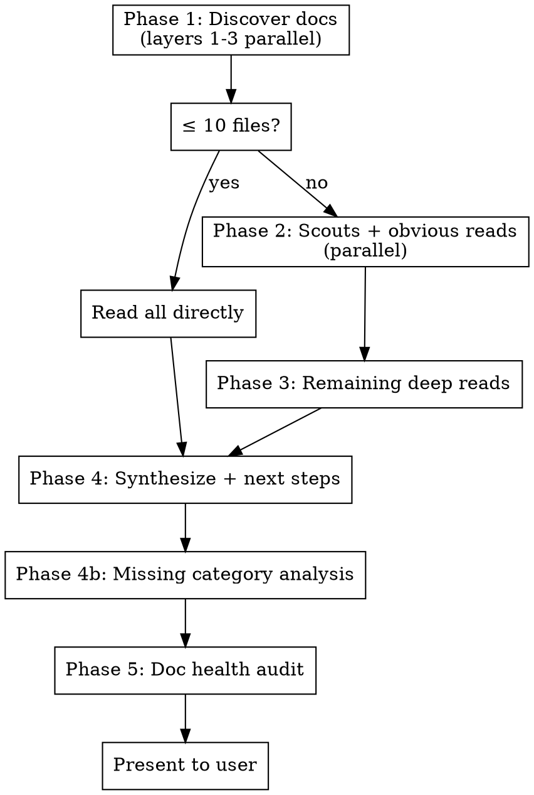

# Recon

Full-spectrum project reconnaissance. Reads all documentation (specs, todos, context, intent, prompt/specification engineering), verifies claims against the actual codebase, audits doc health, and presents prioritized next steps.

**Always runs the full pipeline. No sub-modes.**

## Execution Flow



---

## Phase 1: Discover Docs

Find all documentation files. **Run Layers 1-3 in parallel** (they are independent sources), then combine results.

**Layer 1 — Explicit config:**
Check CLAUDE.md for a `## Recon Files` or `## Spec Files` section. If found, use that list as primary source.

**Layer 2 — Memory:**
Read MEMORY.md and memory files in the project's auto-memory directory.

**Layer 3 — Convention scan:**
Glob for:
- Root: `*.md` (spec.md, todo.md, status.md, dev_notes.md, README.md, etc.)
- `docs/**/*.md`, `specs/**/*.md`, `plans/**/*.md`
- `.claude/**/*.md` (skills, memory)
- `CLAUDE.md` at any depth

All three layers run as parallel tool calls in a single message. Combine their results, deduplicate.

**Layer 4 — Extended scan (only if Layers 1-3 combined yield < 5 files):**
- `**/*.md` excluding `node_modules`, `.git`, `vendor`, `dist`, `build`, `CHANGELOG.md`
- Cap at 50 files; prioritize by most recently modified

**Categorize every file into one or more categories:**

| Category | Signal words / paths | Covers |
|----------|---------------------|--------|
| **Prompt Engineering** | `CLAUDE.md`, `AGENTS.md`, `GEMINI.md`, `.claude/`, skills, hooks | AI agent instructions, prompt optimization |
| **Context Engineering** | `status`, `handoff`, `context`, `memory`, `dev_notes`, `MEMORY.md` | Project state, session continuity |
| **Intent Engineering** | `overview`, `vision`, `goals`, `why`, `purpose`, `intent`, spec preamble | Why we're building, success criteria |
| **Specification Engineering** | `spec`, `design`, `plan`, `architecture`, `RFC`, `ADR`, `docs/plans/` | What to build, how, standards |
| **Task Engineering** | `todo`, `tasks`, `backlog`, `roadmap`, `issues`, `decisions` | What's next, priorities, blockers |

---

## Phase 2: Scan Docs

**Small-repo shortcut (≤ 10 doc files total):** Skip subagents entirely. Read all files directly in main context and proceed to Phase 3 (which becomes a no-op since everything is already read). This avoids subagent overhead when the files would fit comfortably in context anyway.

**Large-repo path (> 10 doc files):** Dispatch parallel subagents with these rules:

**Subagent merging:** Do not spawn a subagent for a category with fewer than 3 files. Merge small categories into a single combined scout. Aim for the fewest subagents that cover all files — typically 2-4 scouts, not 5.

**Parallel deep-read kickoff:** While dispatching scouts, also start reading **obvious Phase 3 candidates** directly in main context in the same message: the primary todo file, the primary spec, and any file modified in the last 24 hours. This overlaps scout wait time with useful reads. Scout results then augment what you already know rather than being a prerequisite.

Each subagent (Explore type) receives its file list and these instructions:

```
You are a recon scout for project documentation.

For EACH file in your list:
1. **Summary** (3-5 lines): What this file contains and its current state
2. **Staleness signals**: Dates, status labels, or claims that appear outdated
3. **Overlap**: Content duplicated in other files you've read
4. **Codebase reality check**: Use Glob and Grep to verify that files, pages,
   features, and paths mentioned in the doc actually exist. Note discrepancies.

IMPORTANT — Prescriptive vs descriptive content:
- **Prescriptive content** (instructions, templates, examples, code blocks,
  files under skills/) tells agents what to DO. Do NOT reality-check these
  against the current codebase — they describe behavior for target repos,
  not claims about this one.
- **Descriptive content** (README, CLAUDE.md, spec files, status files, todo
  items) makes claims about the current project. Reality-check ONLY these.

Return findings as a structured list, one entry per file.
Files to scan: [LIST]
```

Collect all subagent reports before proceeding.

---

## Phase 3: Selective Deep Read

Based on subagent summaries, select **remaining** files for full reading in main context (some may already be read from the parallel kickoff in Phase 2).

**Read fully if any apply (and not already read):**
- File has staleness signals needing assessment
- File contains task lists or next steps
- File is the primary spec or primary todo
- File has codebase discrepancies needing evaluation
- File was modified in the last 7 days

**Context budget:**
- Use the full **5% of context** for deep reads — don't skimp, this is a small price for better repo understanding
- If more files need reading, expand up to **15% total** — but never exceed this
- If all qualifying files would exceed 15%, use the remaining budget (above the initial 5%) to read subagent summaries plus the highest-priority files (primary spec, primary todo, files with codebase discrepancies first)

Use the Read tool directly — do NOT dispatch subagents for this phase.

---

## Phase 4: Synthesize & Present Next Steps

Cross-reference all findings (subagent summaries + deep reads + memory). Think about how the different aspects relate to each other. Then produce:

```markdown
## Project Recon — [Date]

### Current State Summary
[2-3 sentences on where the project stands]

### Next Steps by Category

#### Critical (do first)
1. [P1] **[Category]** — [Task description]
2. [P2] **[Category]** — [Task description]

#### Important (do soon)
3. [P3] **[Category]** — [Task description]

#### Normal (when ready)
4. [P4] **[Category]** — [Task description]

#### Low (backlog)
5. [P5] **[Category]** — [Task description]

### Key Findings
- [Notable insight from cross-referencing docs]
- [Discrepancy between docs and codebase]
- [Non-obvious relationship between items]
```

**Priority rules:**
- Blockers / broken things -> Critical
- Tasks that unblock others -> Important
- Independent improvements -> Normal
- Nice-to-haves / future work -> Low

### Missing Category Analysis

After synthesis, check which of the 5 categories (Prompt, Context, Intent, Specification, Task Engineering) have **zero files**. For each empty category:

1. **Name the gap** — which category is missing
2. **Explain why it matters** — specific to this codebase, not generic advice. Use what you learned from recon to explain what value the file would add here.
3. **Propose a file** — suggest a concrete filename and 1-2 sentence description of what it would contain
4. **Ask the user** — present all missing categories together and ask: "Want me to create any of these?"

If the user agrees, create the files using:
- Findings from this recon session (you already have the context)
- Codebase analysis (Glob, Grep, Read as needed)
- Web search for best practices if the domain requires it

**Do NOT create placeholder/template files.** Every file must contain real, useful content derived from what you know about this project.

---

## Phase 5: Doc Health Audit

### Category C — Auto-apply (silent, no user notification)

Apply immediately:
- Fix typos and grammatical errors
- Correct provably wrong status labels (e.g., "In Progress" when code is complete and deployed)
- Update stale dates that contradict reality
- Remove exact duplicate sentences across files (keep the copy in the most appropriate file)

### Category B — Present with keep/revert

Show the user each proposed change:

```markdown
### Doc Health: Proposed Changes

**1. [File] — [Description]**
Before: [snippet]
After: [snippet]
Reason: [why]

**2. [File] — [Description]**
...

Options: `keep all` | `revert all` | `keep 1,3 revert 2` (example)
```

Category B includes:
- Restructuring sections for clarity
- Merging overlapping content across files into single source of truth
- Deleting paragraphs redundant with other files
- Rewording for clarity or consistency
- Consolidating scattered information

**Revert only undoes Category B changes, not Category C.**

**IMPORTANT:** Never remove nuanced information, caveats, or domain context that might be needed. When in doubt, keep it and flag for the user.

---

## Common Mistakes

- **Using subagents on small repos** — If ≤ 10 doc files, read them all directly. Subagent overhead isn't worth it.
- **Reality-checking instructions as claims** — Skill files, templates, and code blocks describe what to DO, not what EXISTS. Only reality-check descriptive docs (README, CLAUDE.md, specs, status, todos).
- **Hoarding context budget** — Use the full 5% for deep reads. Skimping here means worse synthesis. The budget exists to be spent, not saved.
- **Treating all docs as equal** — Primary spec and todo files matter most. READMEs often lag.
- **Missing codebase cross-reference** — A todo saying "build pricing page" when the page exists is the most valuable finding recon can surface.
- **Over-editing docs** — Category C must be conservative. If not 100% sure a status is wrong, make it Category B.
- **Ignoring memory** — MEMORY.md often has context no single doc file contains.
- **Ignoring empty categories** — A project with no intent or spec docs is a finding, not a non-event. Surface the gap and offer to fill it with real content.
